# ClickHouse Course

ClickHouse = **Click**stream data ware**House**, is a column-oriented Database Management System (DBMS) used for Online Analytical Processing (OLAP) focusing on providing fast response to complex analysis on massive amounts of data ("can easily be 1,000x faster than row-oriented DBMS when used in OLAP scenarios").

Base ClickHouse data types:
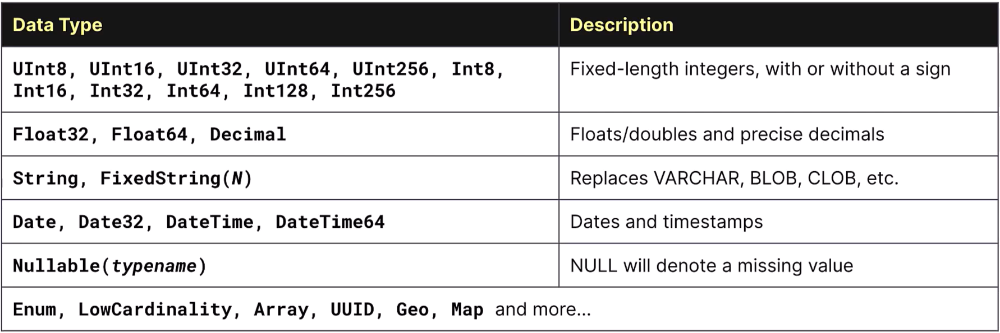
Note that ANSI SQL data types all have appropriate aliases

- ClickHouse can also read and write in dozens of formats (https://clickhouse.com/docs/en/interfaces/formats)

Running on own machine: (using Docker)

- `docker run -d --name some-clickhouse-server --ulimit nofile=262144:262144 clickhouse` starts the ClickHouse server
- `docker exec -it some-clickhouse-server clickhouse-client` enters the user to the built-in ClickHouse client CLI

## Architecture

ClickHouse has a lot of different ways to retrieve and store data to optimize storage and access. Each table has an **_Engine_** (https://clickhouse.com/docs/en/engines/table-engines) which determines how and where its data is stored (local file system, in-memory, external systems, materialized views, ...), defined using `ENGINE = <engine_name>` in the `CREATE TABLE` query.

- It also defines which queries are supported, concurrent data access, multithreading request capabilities, replication, and more.
- There are many _engines_ to integrate ClickHouse with external systems.

#### _Special Engines_:


Almost always the **_MergeTree_** table _engine_ (or one of the other _engines_ in the _MergeTree_ family) will be used as they are the most universal and functional table _engines_ for high-load tasks.

```sql
CREATE TABLE my_db.my_table
(
    column1     FixedString(1),
    column2     UInt32,
    column3     String
)
ENGINE = MergeTree
ORDER BY (column1, column2)
```

Primary key determines how the data is stored and searched, if no `PRIMARY KEY` is specifically defined, then it uses the `ORDER BY` clause. Primary Keys in ClickHouse are not (necessarily) unique to each row (pick columns tha are most frequently searched on). The best strategy is "**lower cardinality values early in the primary key**" (will allows ClickHouse to skip more _granules_ that are straight away not desired)

`INSERT`s are performed in bulk, creating a **_part_** (stored in its own folder). Each column in a _part_ has an immutable file with just the column's data:
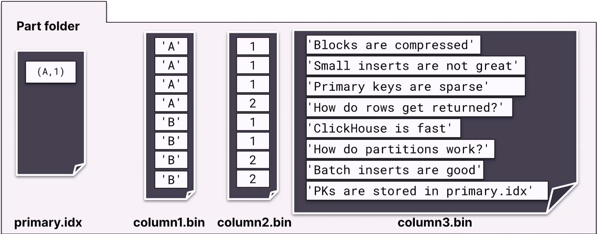

|                                                                                                                                                                                                                                                                                                                                                                                                                                                                                                                             |                          |
| --------------------------------------------------------------------------------------------------------------------------------------------------------------------------------------------------------------------------------------------------------------------------------------------------------------------------------------------------------------------------------------------------------------------------------------------------------------------------------------------------------------------------- | ------------------------ |
| The `primary.idx` file consists of a key per **_granule_** (single, large chunk of rows). So by default, each key represents at most 8,912 rows (or 10MB) of data. This sparse behavior allows for the key to be stored (lives/) in memory (can have millions of rows in database but only hundreds of entries in the primary index), with the file acting as a backup (is not read to be used, only read to be loaded into memory). The **Primary Index** is the value of the primary key of the first row in a _granule_. | 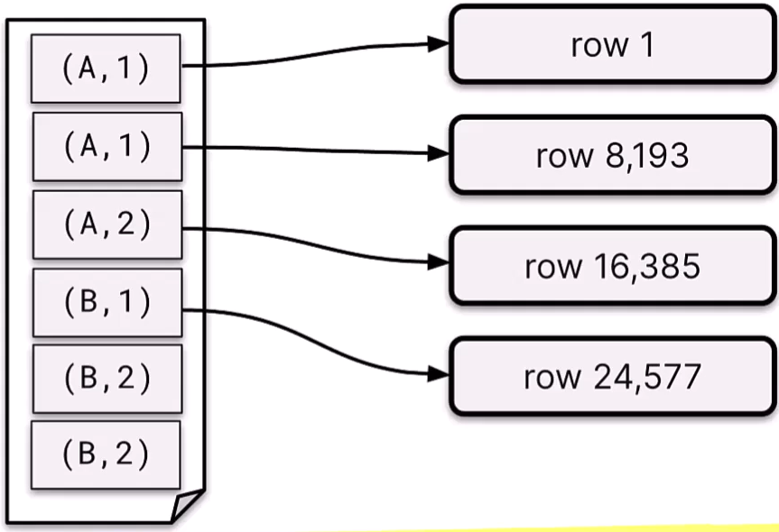 |

**Granule is the smallest indivisible data set that ClickHouse reads when searching rows**.
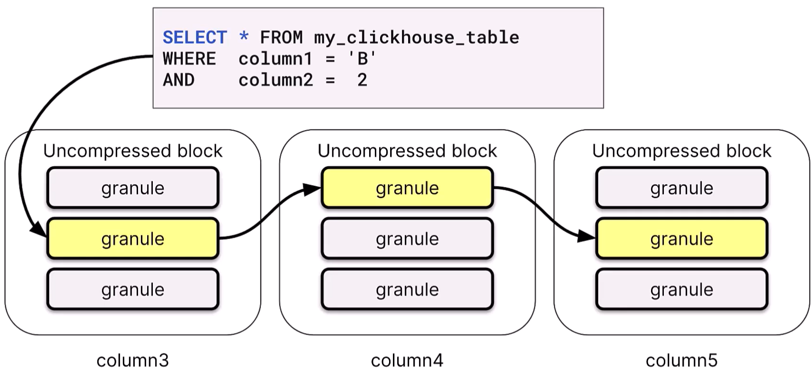
Once ClickHouse knows the _granule(s)_ (called a **_stripe of granules_**) that need to be serached, each _stripe of granules_ is sent to a thread for processing (_stripes_ are processed concurrently, with faster threads stealing tasks from slower threads).

ClickHouse then merges these created folders (partly why its called a _MergeTree_) over time; deleting the unused, redundant _parts_ in favour of the coalesced _merged part_ (can initilize an unscheduled _merge_ using `OPTIMIZE TABLE my_table FINAL;` though it is not recommended). This process it then continued on the _merged part_ folders, creating a cascading tree of merges (Note that this will not end in a single folder as there is a size limit enforced).
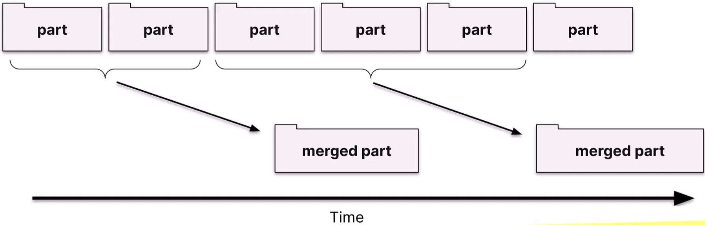
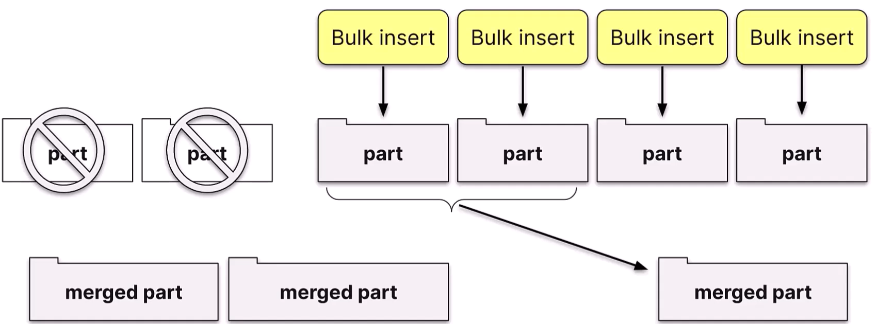
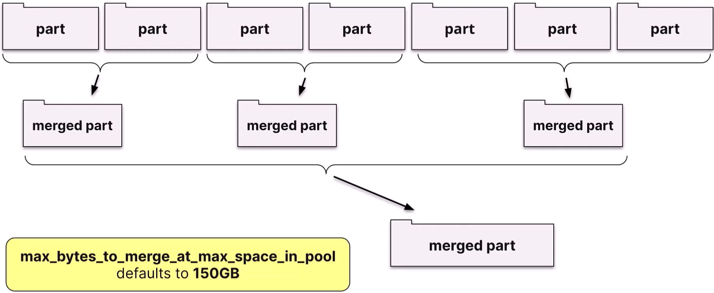

## Modeling Data

As in most DBMSs, ClickHouse logically groups tables into **_databases_** (`CREATE DATABASE my_database`), with the predifined databases being defined at server initialisation: (required for ClickHouse managment processes)
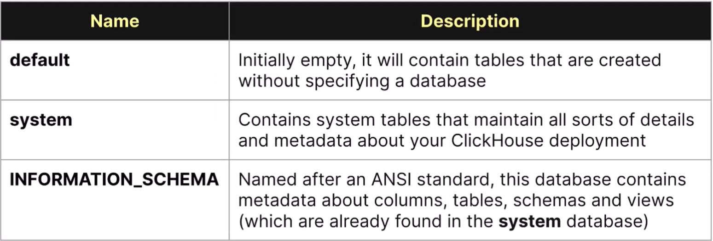
Note that databases also have _engines_; with the default _database engine_ being **_Atomic_**, unless using **_ClickHouse Cloud_** in which case the default _database engine_ is **_Replicated_**.

Table creation also follows traditional DBMSs with teh exception of the _engine_:
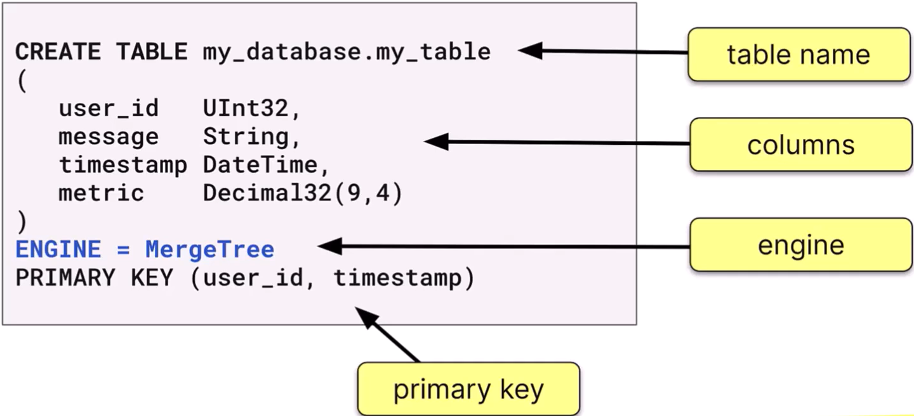

Aside from all the expected SQL-like data types that ClickHouse provides, it additionally provides some more unique and interesting types like:

- **_Array(T)_** defines an array where all the elements have the same data type
  | | |
  | - | - |
  | 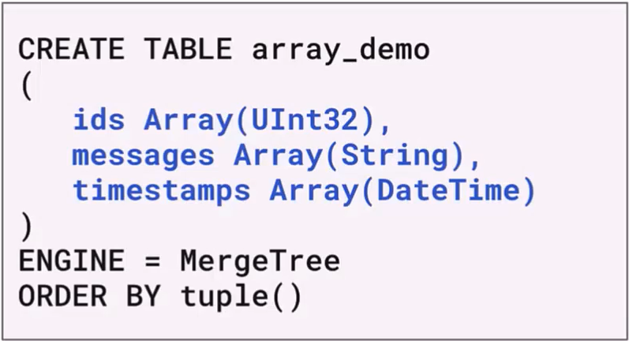 | 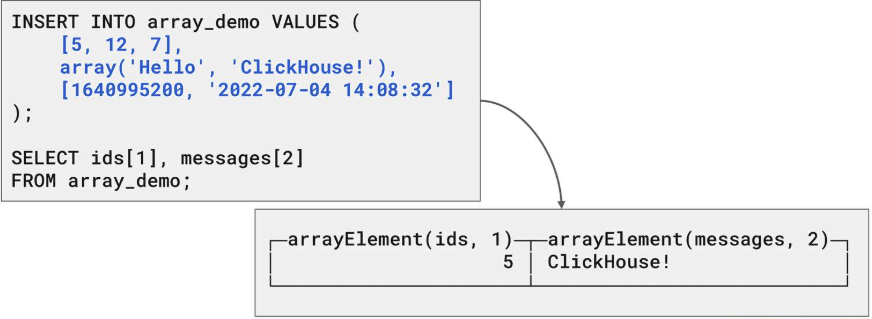 define array using `[]` or `array()` |

- **_Nullable(T)_** allows for NULL values to be used for missing values (if it is not important to the buisness logic, do not use as it increases dimentionality of table)
  | | |
  | - | - |
  | 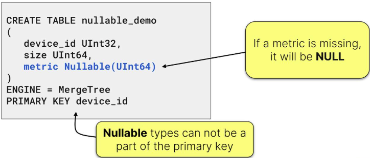 | 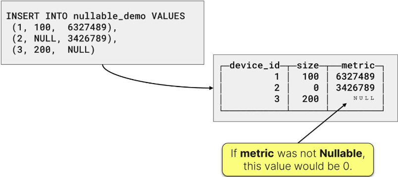 |

- **_Enum(T)_** is used for defining enumerations
  | | |
  | - | - |
  | 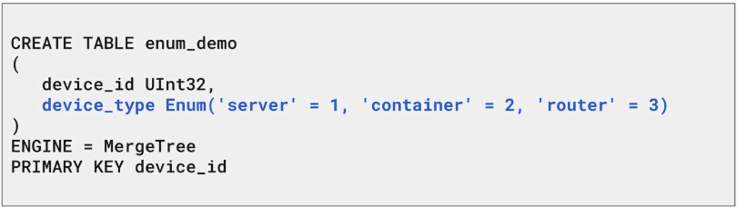 | _enum_ column can only contain values in its definition, else throws exception 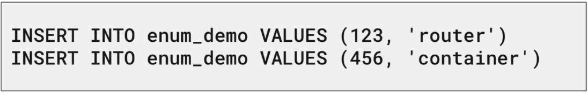 |

  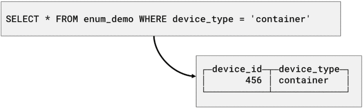

- **_LowCardinality(T)_** is useful when a column has a relatively small number of unique values (hard to quantify but can be useful with **<=10000 unique values**); as it uses **dictionary encoding** to store the values as integers. Advantage over _enum()_ as new values can be dynamically added (no need to know all unique values at creation time).
  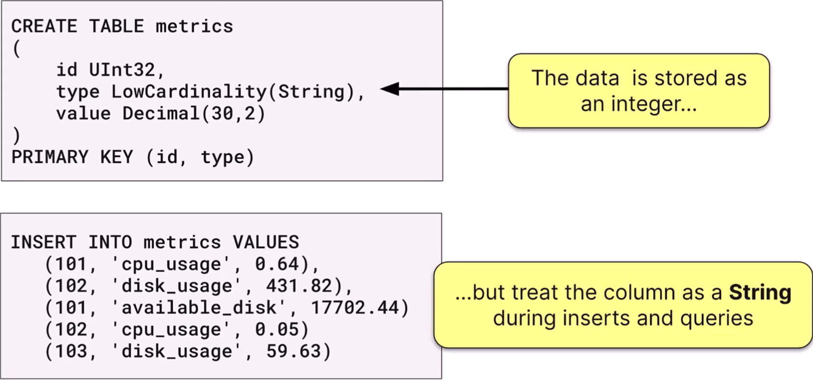

Primary keys can be defined in several ways:

- **Inside** column list:
  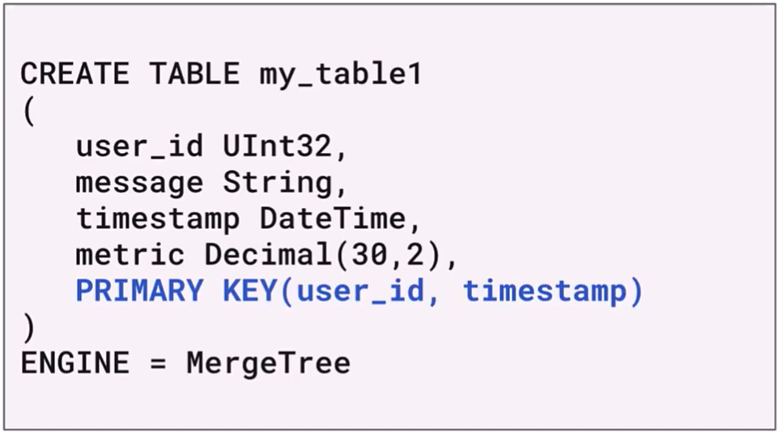
- **Outside** column list:
  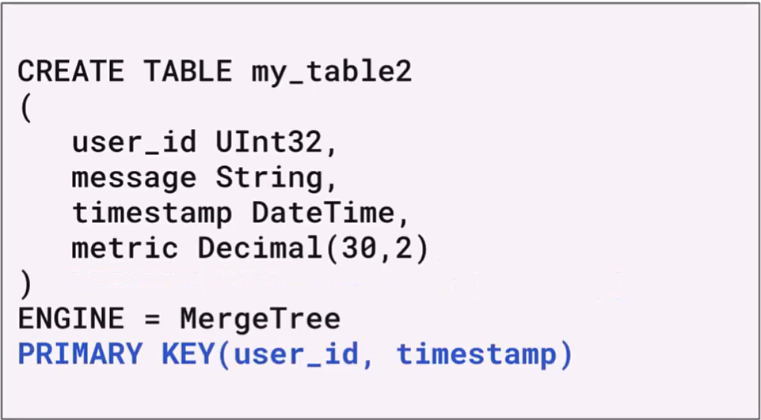
- Using `ORDER BY` instead of `PRIMARY KEY` (with no `PRIMARY KEY` clause)
  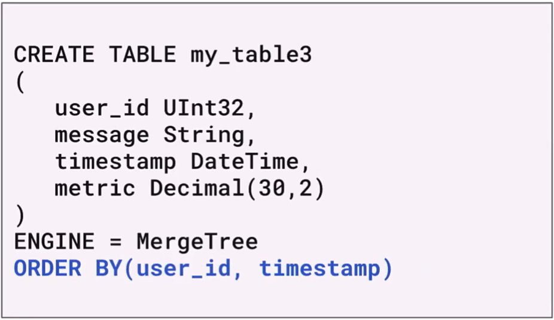

iF both `ORDER BY` and `PRIMARY KEY` are defined, the **primary key** must be a **prefix of** the **order by tuple**:
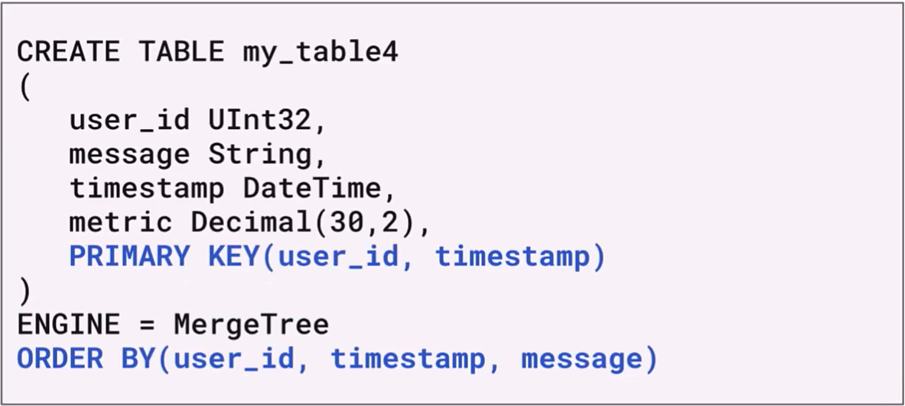

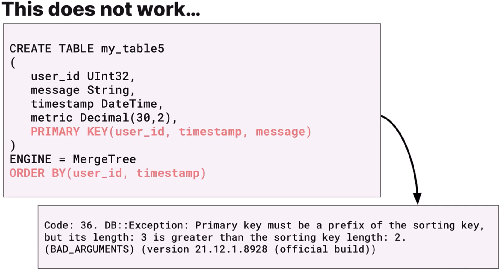
Good candidates for primary key columns are ones which are queried on frequently, ordered by cardinality in ascending order (at some point adding a column to a primary key no longer provides any benefit).

For creating additional primary indexes consider:

- creating two tables for the same data with different primary keys.
- use **_projection_** (ClickHouse creates hidden table that stores the data sorted in a different way)
- use a **_materialized view_**, a seperate tables based on a SELECT statement.
- define a **_skipping index_**

It's logical to assume that partitioning (logical combination of records in a table by a specific criterion) data improves query performance and they can help limit the number of granules serached but partitions (in ClickHouse) are mostly for data managment.
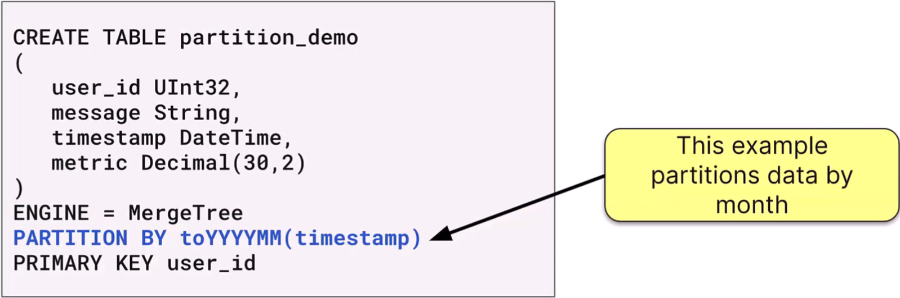
Partitions can improved the performance of mutations, moving data around, retention policies, adn so on. In general, to improve performance focu on defining a good primary key.

In most cases, partition key is not required; and in most other cases, a partition key more granular than by month is not required.

```sql
-- creates a view that will calculate the data used when (un)compressed by the tables defined:
CREATE VIEW memory_usage_per_tables AS (
  SELECT
    table,
    formatReadableSize(sum(data_compressed_bytes)) AS compressed_size,
    formatReadableSize(sum(data_uncompressed_bytes)) AS uncompressed_size,
    count() AS num_of_active_parts
  FROM system.parts
  WHERE (active = 1) AND (table IN {table_names:Array(String)})
  GROUP BY table
);
```

```sql
SELECT *
FROM memory_usage_per_tables(table_names = ['uk_prices', 'generation'])

Query id: 678c9ce2-25b1-4467-911a-68a53a681055

   ┌─table──────┬─compressed_size─┬─uncompressed_size─┬─num_of_active_parts─┐
1. │ uk_prices  │ 876.59 KiB      │ 19.56 MiB         │                   1 │
2. │ generation │ 2.00 GiB        │ 10.79 GiB         │                   7 │
   └────────────┴─────────────────┴───────────────────┴─────────────────────┘

2 rows in set. Elapsed: 0.004 sec.
```

## Inserting Data

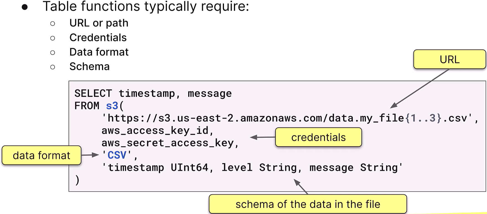
sometimes ClickHouse can infer the column names and data types (schema might not have to be defined explicitly). And sometimes ClickHouse can also figure out the format of the datafile (from the filename extension); and its compression (from its extension)

ClickHouse supports over 75 data formats (TSV, CSV, ..., 20+ formats for JSON data, ..., Protobuf, Parquet, Arrow, ...)

**_Table Engine_** has to be used for Provider-Subscriber platforms like Kafka (uses ClickPipes if using _ClickHouse Cloud_)
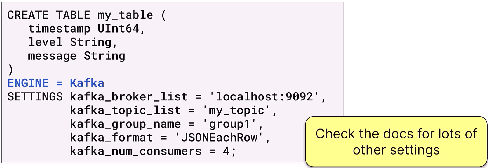

### Table Functions vs Table Engines

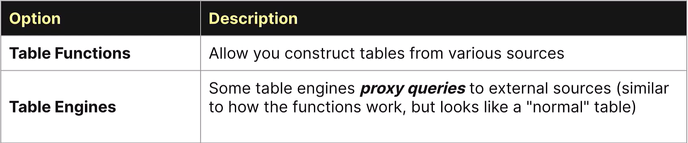
table engines in general store all the connection details, teh type of file, the schema, the credentials, etc. These are not required to be entered everytime they are accessed (like a proxy) instead the files stay on the 3rd party server but can be queried as if on the ClickHouse server (when queried streams data to ClickHouse server).
| | |
|-|-|
|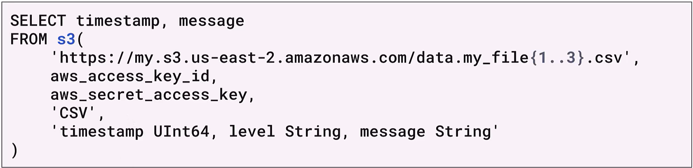|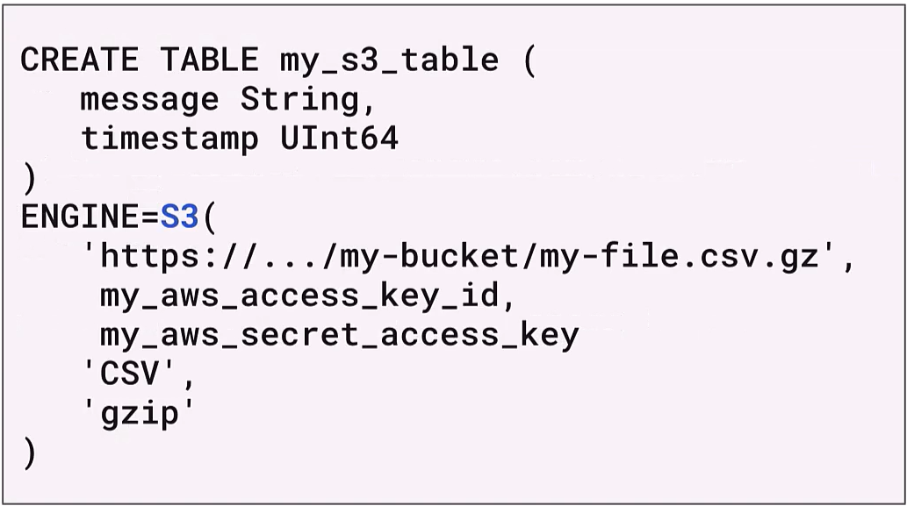|

PostgreSQL and MySQL have special **_database engines_** as well:
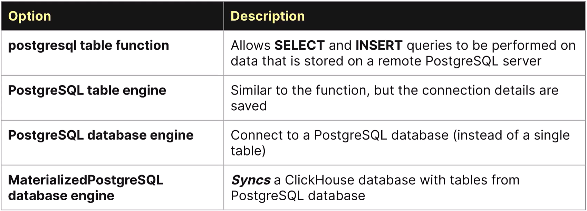

## Views

The concept of views in ClickHouse is similar to views in other DBMSs; with the contents of a view table being based on teh results of a `SELECT` query.
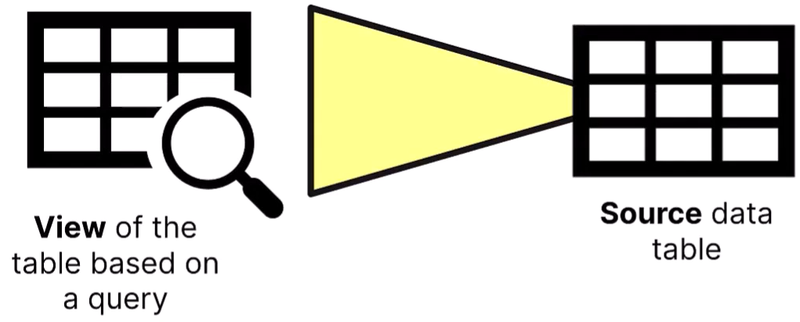

### Parameterized Views

ClickHouse additionally facilitates **_Parameterized Views_**, allowing for the view definition to change based on some parameters that can be fed at query execution time.

```sql
CREATE VIEW raw_data_parametrized AS
SELECT *
FROM raw_data
WHERE (id >= {id_from:UInt32}) AND (id <= {id_to:UInt32});
```

```sql
clickhouse-cloud :) SELECT count() FROM raw_data_parametrized(id_from=0, id_to=50000);

SELECT count()
FROM raw_data_parametrized(id_from = 0, id_to = 50000)

Query id: 5731aae1-3e68-4e63-b57f-d50f29055744

┌─count()─┐
│ 317019  │
└─────────┘

1 row in set. Elapsed: 0.004 sec. Processed 319.49 thousand rows, 319.49 KB (76.29 million rows/s., 76.29 MB/s.)
```

### Materialized Views

**_Materialized Views_** in ClickHouse are `INSERT` triggers that **store** the result of a query inside anothe rdestination table. This means that when an `INSERT` happens to the source table of the `SELECT` query, the query is executed on newly-inserted rows and the result is inserted into the MV table (No trigger on `DELETE`, `UPDATE`,etc.).
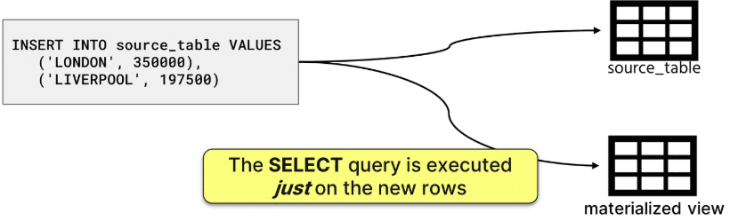
Note that ClickHouse creates a hidden table in addition to the materialized view for each MV, called `.inner.{uuid}` (has to do with how MVs work in ClickHouse). Instead of having ClickHouse implicitly create `.inner.{uuid}` as the hidden table; one can define an explicit table for a view, and then define a materialized view that sends its data **_"to"_** the explicit table (seperate the view from its underlying table):

1. Define the **_destination table_**

   ```sql
   CREATE TABLE uk_price_by_town_dest (
     price UInt32,
     date  Date,
     streat  LowCardinality(String),
     town  LowCardinality(String),
     district  LowCardinality(String)
   )
   ENGINE = MergeTree
   ORDER BY town;
   ```

2. Define the MV using the `TO` clause "to: the destination table

   ```sql
   CREATE MATERIALIZED VIEW uk_price_by_town_view TO uk_price_by_town_dest AS (
     SELECT price, date, street, town, district FROM uk_price_paid
     WHERE date >= toDate('2024-02-19 12:30:00') -- pick a time in the "not too distant" future
   );

   ```

3. **_Populate the destination_** table with historic data

   ```sql
   INSERT INTO uk_price_by_town_dest
     SELECT price, date, street, town, district FROM uk_price_paid
     WHERE date < toDate('2024-02-19 12:30:00')
   ```

### Aggregations in MVs

Materialized Views on their own cannot handle running average calculations:

<table>
<tr>
<td>

```sql
CREATE TABLE some_numbers
(
    `id` UInt32,
    `x` UInt32
)
ENGINE = MergeTree
PRIMARY KEY id

Query id: f9a828cc-52e6-493a-b4b5-222872bac207

Ok.
```

</td>
<td>

```sql
CREATE TABLE agg_of_some_numbers
(
    `id` UInt32,
    `max_id` UInt32,
    `avg_id` UInt32
)
ENGINE = MergeTree
PRIMARY KEY id

Query id: 61284097-f0b0-476c-bb78-cb7d01efc183

Ok.
```

</td>
<td>

```sql
CREATE MATERIALIZED VIEW view_of_agg_of_some_numbers TO agg_of_some_numbers
AS SELECT
    id,
    max(x) AS max_id,
    avg(x) AS avg_id
FROM some_numbers
GROUP BY id

Query id: 4c542be8-c5e9-4749-aff3-2fc5e157e5d7

Ok.
```

</td>
</tr>
</table>

<table>
<tr>
<td>

```sql
INSERT INTO some_numbers FORMAT Values -- (1,10), (1,20), (2, 300), (2,400)

Query id: 97b410e8-967f-49aa-a68c-8e903f162306

Ok.
```

The first insertion into the table will have the calculations work properly:

</td>
<td>

```sql
SELECT *
FROM agg_of_some_numbers

Query id: 72cdb105-024c-4c78-aef4-cb1282fa007e

   ┌─id─┬─max_id─┬─avg_id─┐
1. │  1 │     20 │     15 │
2. │  2 │    400 │    350 │
   └────┴────────┴────────┘

2 rows in set. Elapsed: 0.004 sec.
```

</td>
</tr>
<tr>
<td>

```sql
INSERT INTO some_numbers FORMAT Values -- (1,1000), (2,20)

Query id: e038491f-a438-4373-b3c5-c2e612e306d8

Ok.
```

Further insertions into the table will result in the calculations being performed incorrectly, treating each block as entirely different from each other; not like the running aggregations that were expected:

</td>
<td>

```sql
SELECT *
FROM agg_of_some_numbers

Query id: 20438124-e997-480e-811e-27cb8a633e12

   ┌─id─┬─max_id─┬─avg_id─┐
1. │  1 │   1000 │   1000 │
2. │  2 │     20 │     20 │
   └────┴────────┴────────┘
   ┌─id─┬─max_id─┬─avg_id─┐
3. │  1 │     20 │     15 │
4. │  2 │    400 │    350 │
   └────┴────────┴────────┘

4 rows in set. Elapsed: 0.006 sec.
```

</td>
</tr>

</table>

The special _engine_, **_AggregatingMergeTree_**, is designed specifically for dealing with (running) aggregations. This is useful when repetitively running aggregation queries in ClickHouse on (relatively) slowly changing data; instead of calculating them every time from scratch, a running aggregations can be used.

_AggregatingMergeTree_ collapses rows with the **same primary key (sort order)** into a single record, with the set of values of the combined rows aggregated. The columns keep track of the **"state"** of each set of values, with supported column types;
**_AggregateFunction(T,U)_**, and **_SimpleAggregateFunction(T,U)_**

- **_T_** : **aggregation function** to be used by the column
- **_U_** : **data type** to be used by the column

<table>
<tr>
<td>

```sql
CREATE TABLE amt_of_some_numbers
(
    `id` UInt32,
    `max_column` SimpleAggregateFunction(max, UInt32),
    `avg_column` AggregateFunction(avg, UInt32)
)
ENGINE = AggregatingMergeTree
PRIMARY KEY id

Query id: c79beea8-ccaa-4668-b4bd-9781f6001ac8

Ok.
```

</td>
<td>

```sql
CREATE MATERIALIZED VIEW view_of_amt_of_some_numbers TO amt_of_some_numbers
AS SELECT
    id,
    maxSimpleState(x) AS max_column,
    avgState(x) AS avg_column
FROM some_numbers
GROUP BY id

Query id: 6cef55f6-e7ef-46de-aefc-1a7774d7cf43

Ok.
```

**Must use** the `(Simple)State` combinator/suffix functions corresponding to the variable's `(Simple)AggregateFunction` data types.

</td>
</tr>
</table>

<table>
<tr>
<td>

```sql
INSERT INTO some_numbers FORMAT Values -- (1,10), (1,20), (2, 300), (2,400)

Query id: c111aac6-a3f3-4438-bf5c-a5e6146a02b4

Ok.
```

```sql
INSERT INTO some_numbers FORMAT Values -- (1,1000), (2,20)

Query id: c1b6addb-52cb-4b67-bfa2-dd11c717a7d7

Ok.
```

Some interesting results occur now when this is used: **1)** the _parts_ have not merged yet, and **2)** the avg_column is storing binary data.

</td>
<td>

```sql
SELECT *
FROM amt_of_some_numbers

Query id: 1ce49fad-f265-4b44-8052-926d453e6748

   ┌─id─┬─max_column─┬─avg_column─┐
1. │  1 │       1000 │ �♥☺           │
2. │  2 │         20 │ ¶☺           │
   └────┴────────────┴────────────┘
   ┌─id─┬─max_column─┬─avg_column─┐
3. │  1 │         20 │ ▲☻           │
4. │  2 │        400 │ �☻☻           │
   └────┴────────────┴────────────┘

4 rows in set. Elapsed: 0.009 sec.
```

</td>
</tr>
</table>

Note that if `INSERT` is done via `SELECT` query, type coercion must be done using the `(Simple)State` combinator/suffix functions:

```sql
INSERT INTO some_numbers
  SELECT
    id,
    maxSimpleState(x) as max_column,
    avgState(x) as avg_column
  FROM numbers
  GROUP BY id
```

These unusual results are due to ClickHouse storing an intermediate state as opposed to the final result (not be able to calculate moving aggregates from final value). Therefore, one must query the table using the appropriate aggregation functions with a `Merge` combinator/suffix (for `AggregateFunction` types):

```sql
SELECT
    id,
    max(max_column),
    avgMerge(avg_column)
FROM amt_of_some_numbers
GROUP BY id

Query id: 1b0e7fea-f040-417e-80b9-02e87b89b094

   ┌─id─┬─max(max_column)─┬─avgMerge(avg_column)─┐
1. │  2 │             400 │                  240 │
2. │  1 │            1000 │    343.3333333333333 │
   └────┴─────────────────┴──────────────────────┘

2 rows in set. Elapsed: 0.012 sec.
```

#### SummingMergeTree

The _engine_ **_SummingMergeTree_**, similarly to _AggreationgMergeTree_, collapses rows with the **same primary key (sort order)** into a single record. But differs from _AggreationgMergeTree_ by **only summarizing the columns**, maintaining the original numeric data type.

Due to this, there is no need to use the `(Simple)State` combinator/suffix functions or the `(Simple)AggregateFunction` data types:

<table>
<tr>
<td>

```sql
CREATE TABLE prices_sum_dest
(
    `town` LowCardinality(String),
    `price` UInt32
)
ENGINE = SummingMergeTree
ORDER BY town
```

Note that there might be **multiple rows with the same primary key** that should be aggregated, hence should always use the `sum` and the `GROUP BY` query.

</td>
<td>

```sql
CREATE MATERIALIZED VIEW price_sum_view TO prices_sum_dest
(
    `town` String,
    `price` UInt32
)
AS SELECT
    town,
    price
FROM uk_price_paid
```

</td>
</tr>
</table>

## Sharding and Replication

**_Sharding_** provides scalability; splitting a database into multiple smaller tables, called _shards_, (a table has one _shard_ by default) stored on **different servers**. Do not _shard_ a table unless it is really neccessary (a lot of data can fit in a single _shard_), instead attempt to increase the machine's capacity (Disk space, RAM, Cores, etc.). **_Replication_** provides redundancy, with each _shard_ consisting of >=1 _replicas_ (containing the same data per _shard_), placed on **different servers**, so if one serveer fails, the data is still available. Each _MergeTree_ _engine_ has a "replicated" version, **_ReplicatedMergeTree_** (or _SharedMergeTree_ if in the cloud).
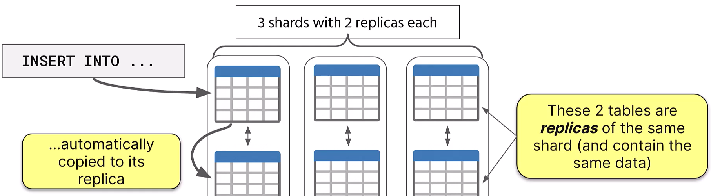
Replication also requires **_ClickHouse Keeper_** (centralized service for reliable distributed coordination similar to **_Apache ZooKeeper_**) which tracks the state of each _replicas_ to keep them in sync, typically run on a seperate machine (can also be executed within `clickhouse-server` processes).

**_Server Hosts_** (_server_) are the hardware (cloud/on-premises) that makes up the machines (more CPU cores improves data ingestion speeds, faster disks improve query performance, more memory improves data with high cardinality - where more sorting is needed); whereas **_Database Hosts_** (_host_) are the running instances of ClickHouse (multiple _hosts_ can run in a single _server_). A **_Cluster_**, not to be confused with the physical cluster of servers, is a user-defined **logical collection of >=1 shards** (which consists of _replicas_)
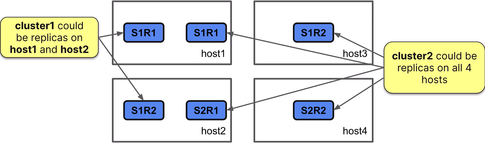

<table>
<tr>
<td>

1. **configure a cluster** in `/etc/clickhouse-server/config.xml`

   ```xml
   <remote_servers>
     <cluster1>
       <shard>
         <internal_replication>true</internal_replication>
         <replica>
           <host>host1</host>
           <host>9000</host>
         </replica>
         <replica>
           <host>host2</host>
           <host>9000</host>
         </replica>
       </shard>
       <shard>
         <internal_replication>true</internal_replication>
         <replica>
           <host>host3</host>
           <host>9000</host>
         </replica>
         <replica>
           <host>host4</host>
           <host>9000</host>
         </replica>
       </shard>
     </cluster1>
   </remote_servers>
   ```

</td>
<td>

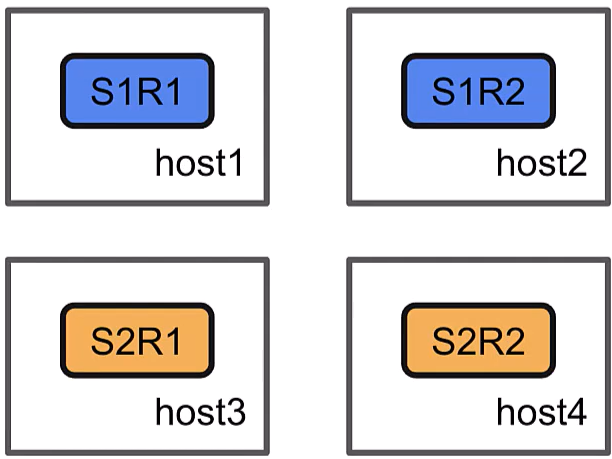

Each clickhouse host/instance contains a single replica of a single shard. To have a single physical host contain multiple clickhouse instances, virtualization (docker, etc.) must be used.

</td>
</tr>
<tr>
<td>

2. **configure ZooKeeper/ClickHouse Keeper** in `/etc/clickhouse-keeper/keeper_config.xml`

   ```xml
   <keeper_servers>
      <tcp_port>2181</tcp_port>  <!-- servers talk to keeper on this port -->
      <server_id>1</server_id> <!-- Must be unique among all keeper serves -->
      <raft_configuration> <!-- consensus algorithm used by ClickHouse Keeper -->
         <!-- all servers in quorum -->
         <server>
            <id>1</id>
            <hostname>keeper1</hostname>
            <port>9234</port> <!-- keeper nodes talk to each other on this port -->
         </server>
         <server>
            <id>2</id>
            <hostname>keeper2</hostname>
            <port>9234</port>
         </server>
         <server>
            <id>3</id>
            <hostname>keeper3</hostname>
            <port>9234</port>
         </server>
      </raft_configuration>
   </keeper_servers>
   ```

</td>
<td>

3. **Tell the _hosts_ where ClickHouse Keeper is running** in `/etc/clickhouse-server/config.xml`

   ```xml
   <zookeeper>
        <node>
            <host>keeper1</host>
            <port>2181</port>
        </node>
        <node>
            <host>keeper2</host>
            <port>2181</port>
        </node>
        <node>
            <host>keeper3</host>
            <port>2181</port>
        </node>
   </zookeeper>
   ```

   ClickHouse Keeper provides the coordination system for data replication and distributed DDL queries execution (compabilbe with Apache ZooKeeper); Synchronizing all replicas and shards correctly.

</td>
</tr>
</table>

<table><tr><td>

2 _replicas_ **with the same paths** in ClickHouse Keeper will hold the same data (all names and paths are arbitrary). Therefore, instead of writting the same commands on all _hosts_, using the `ON CLUSTER` suffix, a command/query is written on all _hosts_ in the cluster automatically.

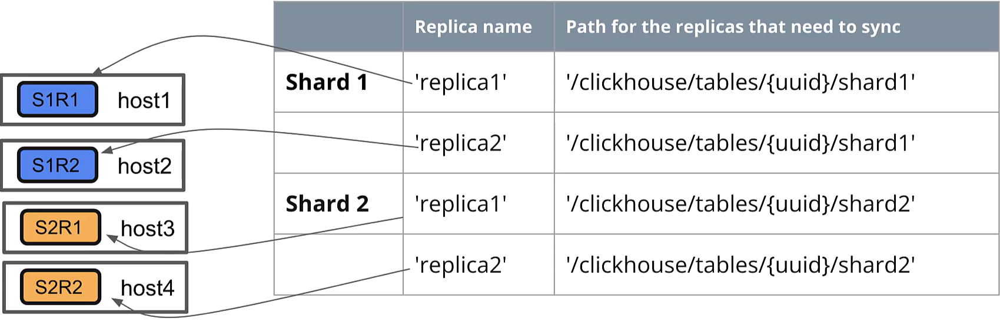

</td><td>

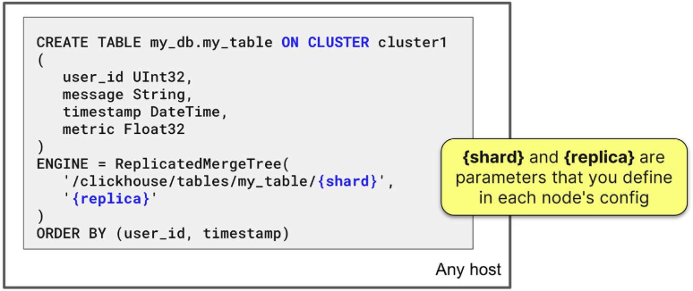
Note that the `{parameters}` must be defined in `<macros>` inside the clickhouse-server in `/etc/clickhouse-server/config.xml`

</td></tr></table>

While the data is then replicated across the _replicas_ (automatically), the _shards_ are disconnected from one another and so in order to access the whole database (split between _shards_), a table with a **_Distributed_** _engine_ must be created (using the schema of the distributed table). Note that this table only needs to be created on one of the _hosts_.

<table><tr><td>

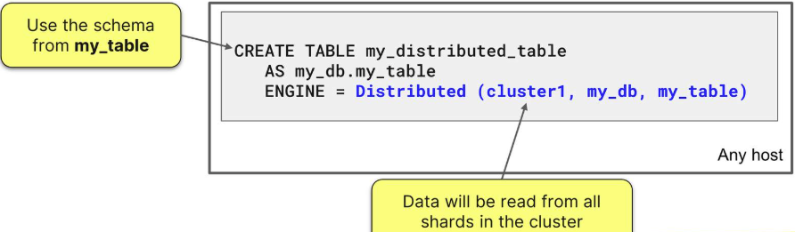

</td><td>

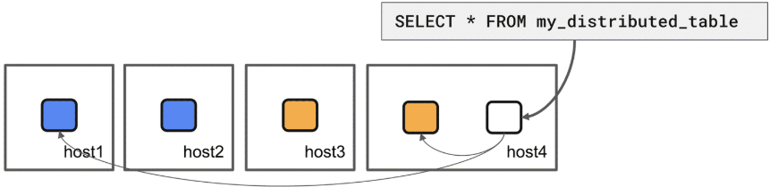

</td></tr></table>

Querying this table forwards the command to one _replica_ of each _shard_, with each _replica_ processing its part of the data, sending back its results to be combined to determine the final result. Note that inserting data into the local table (not _Distributed_) will replicate automatically on all _replicas_ of the _shard_ but will not load balance the request across the _shards_ (for this must insert into _Distributed_ table)

### Views of Distributed Tables

There are two methods of creating a distributed MV:

1. Define the MV locally on each _replica_, leading to the MVs processing locally with no added network overhead; with a _distributed_ table being defined for easy querying of the multiple view tables.
   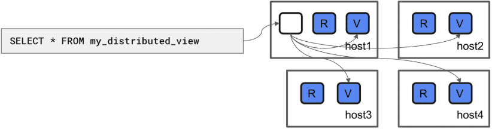
2. Define a _distributed_ MV of a _distributed_ table (can specify _sharding_ key), leading to any activity on the _distributed_ table propagating to the MV
   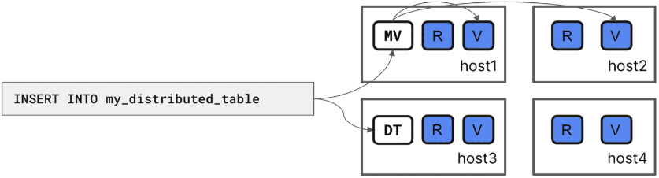

### ClickHouse Cloud

_ClickHouse Cloud_ uses a cloud-native replacement to _ReplicatedMergeTree_ , called **_SharedMergeTree_** (automatically convertes user-defined _engines_ to its _SharedMergeTree_ type); which works with shared storage (S3, GCS, etc.) and thereby does not require _sharding_ (every table has 1 shard), provides a greater seperation of compute and storage, and faster replication, mutation, and merges.

## Data Joining

https://clickhouse.com/docs/en/guides/joining-tables

Clickhouse supports all SQL JOINs, teh difference comes from how ClickHouse handles the right vs left tables in the join. Joining large datasets require a lot of memory and CPU power; and so to ensure maximum utilization of resources, ClickHouse has 6 different join algorithms:

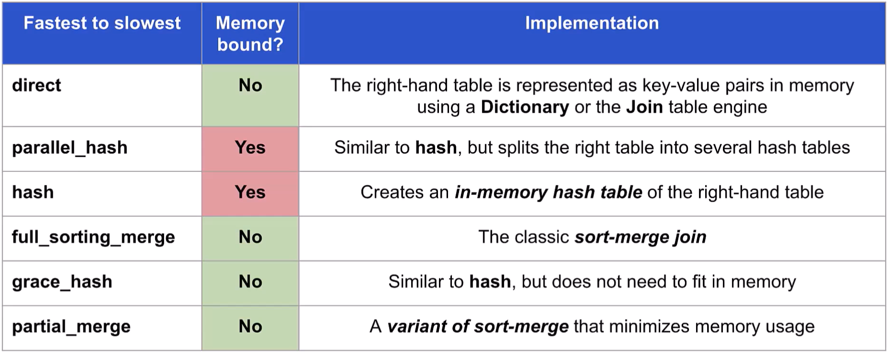

Default is **_direct_** but if Dictionary/Join table _engine_ are not implemented, **_hash_** is defaulted to (memory bound and so can fail)

<table><tr><td>

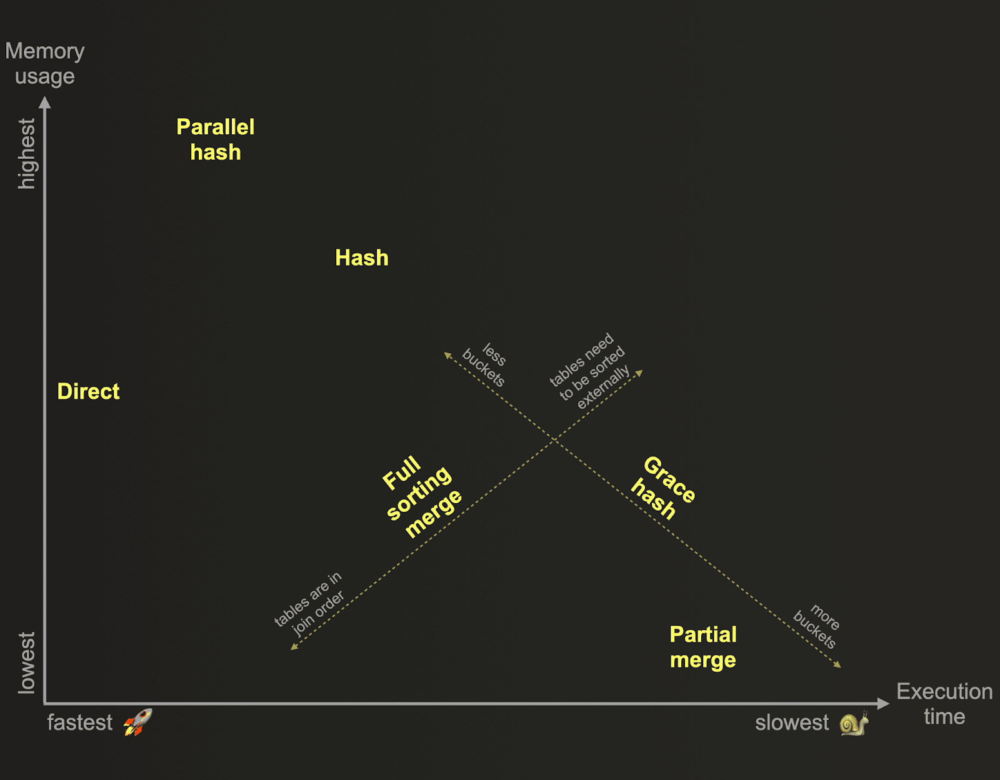

</td><td>

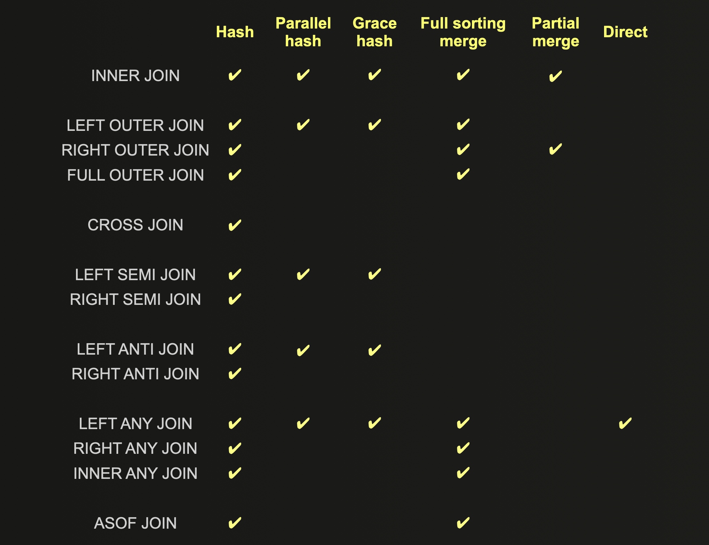

</td></tr></table>

```sql
SELECT *
FROM actor AS a
JOIN roles AS r ON a.id = r.actor_id
SETTINGS join_algorithm = 'hash'
```

### Hash JOINs

A **_hash table_** is built **in memory** from the right-hand table; with '**_hash_**' building a single _hash table_, '**_parallel_hash_**' buckets the data and builds several _hash tables_ ('**_grace_hash_**' is similar to '_parallel_' but limits the memory usage). The data in the right-hand table is streamed (in parallel) into memory with the data in the left-hand table streamed and joined by doing lookups into the hash table.

Note that the **table must fit in memory**; if not, an exception occurs and the JOIN fails (put the smaller table on the right side of the JOIN)

### Sort Merge JOINs

These join algorithms require the data to be sorted first, with '**_full_sorting_merge_**' requiring **both tables** to be **sorted before joining** (classical sort-merge) while '**_partial_merge_**' requires the **right-hand table** to be sorted before joining. To achieve the best performance for these algorithms; tables should be sorted (`ORDER BY`) on the attributes used in their join statement.

Note that sorting takes place in memory if possible (otherwise spills to disk). Also, '_full_sorting_merge_' can have similar performances to '_hash_' but uses much less memory.

### Direct Joins

A **_Dictionary_** is a special type of **key-value "table"** (typically) stored in memory, tied to a **_source_** (rows/mappings come from another place like local file, executable file, http(s), etc.), periodically updated.
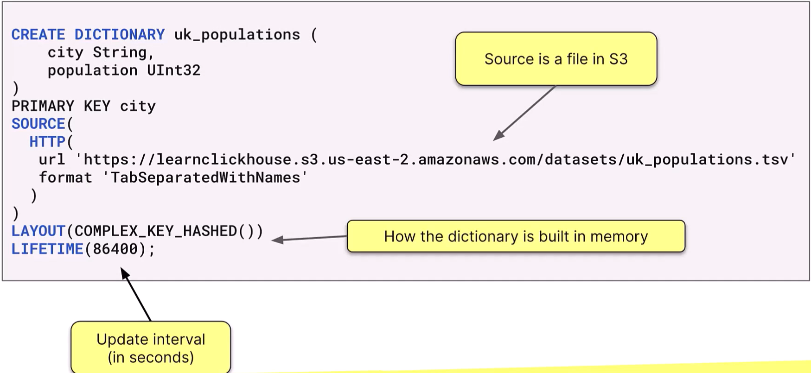
once the dictionary is set, querying it is done using `dictGet(<dictionary_name>, <attribute_name>, <value_of_key>)`, thereby performing similar to a join function.

If the updating mechanism is not required, **_Join_** _table engine_ (right-hand table is sorted in memory) can be used. A table is specified with `Engine = Join(join_strictness, join_type, keys)`, where **_join_strictness_** and **_join_type_** allow ClickHouse to take advantage of the user's knowledge about how the table will be joined to optimise execution time and memory usage.

An **_EmbeddedRocksDB_** _table engine_ (right-hand table is a **_rocksdb_** table) https://clickhouse.com/docs/en/engines/table-engines/integrations/embedded-rocksdb https://rocksdb.org/. By being a RocksDB table, A special _direct_ join with EmbeddedRocksDB tables is supported; which avoids forming a hash table in memory and accesses the data directly from the database.

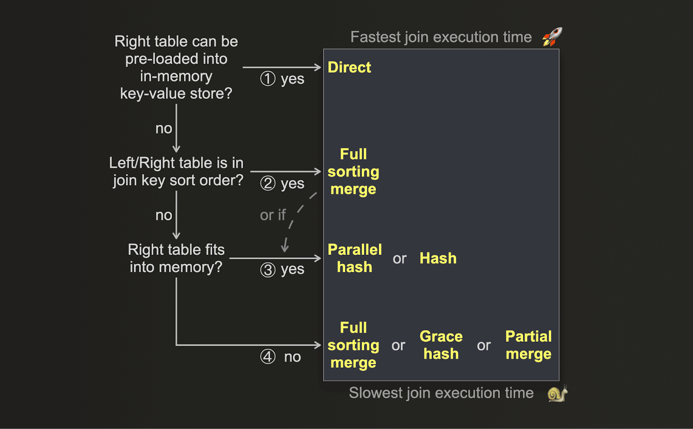

## Deleting and Updating Data

_Parts_ in ClickHouse are **immutable** files and so updates/deletions can only occur when _parts_ merge (heavy-weight operation). These require the `ALTER TABLE` command (`ALTER TABLE random UPDATE y = 'hello' WHERE x > 10;`, etc. note however that updates cannot occur on a primary key column), called a **_mutation_**, which does not execute immediately (like an event) but is kept (inside `system.mutations`) until the next merge where it is realized (can have the client wait until the mutation is realized by setting `mutation_sync = 1 || 2`).

_Mutations_ execute in the order they were created, and each _part_ is processed in that order (data inserted after _mutation_ is not _mutated_); and if a mutation gets stuck, it can be stopped using `KILL MUTATION`. _Mutations_ in replicated tables are handled by _ZooKeeper_.

### Lightweight Mutations

Only available in _ClickHouse Cloud_, **_Lightweight Mutations_** leverage hidden columns to dynamically apply the certain _mutations_ so their effects take place immediately (no need to wait for next merge).

**_Lightweight Delete_** uses `DELTE FROM my_table WHERE y != 'hello';`,a different syntax to that of a mutation (more a lightweight operation than a _mutation_). This marks the deleted rows using a special hidden column with queries automatically rewritten to exclude them (eventually deleted during the next merge).

**_Lightweight Update_** use the same syntax as mutation updates but require setting `SET apply_mutation_on_fly = 1;`, causing the rows to appear to have updated immediately (haven't but will in the next merge). Frequent lightweight updates can have a negative impact on performance.

### Deduplication

When data is updated frequently, it is not performally feasible to use (_lightweight_) _mutations_ and instead; a combination of **upserting/re-inserting** data with special _table engines_ (designed for deleting duplciated records) can be used: (work on both _ClickHouse Cloud_ and open source)

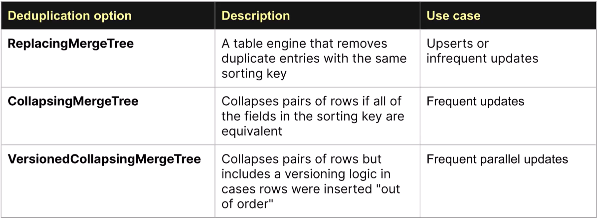

While these will have the correct internal logic; similar to the aforementioned options, the data does not trully update until the next merge is initiated (queries will return unexpected results). To fix this, `FINAL` is used at the end of queries to indicate to ClickHouse that the proper representation of the data is desired.

- **_CollapsingMergeTree(T)_** tables must have a `sign Int8` attribute on which it collapses. `sign = 1` means that the row is a state of an object; whereas `sign = -1` means the cancellation of the state of an object with the same attributes. These then act similar but not entirely equal to replace and delete operations. Note that this _engine_ allows only strictly consecutive insertions.
- **_VersionedCollapsingMergeTree(T,U)_** works similar to _CollapsingMergeTree_ but allows for out of order insertions (using multiple threads) by having an additional `version` attribute (commonly `TimeStamp`).
- **_ReplacingMergeTree_** similar to _VersionedCollapsingMergeTree_ can have an optional `version` attribute to prevent racing conditions.
